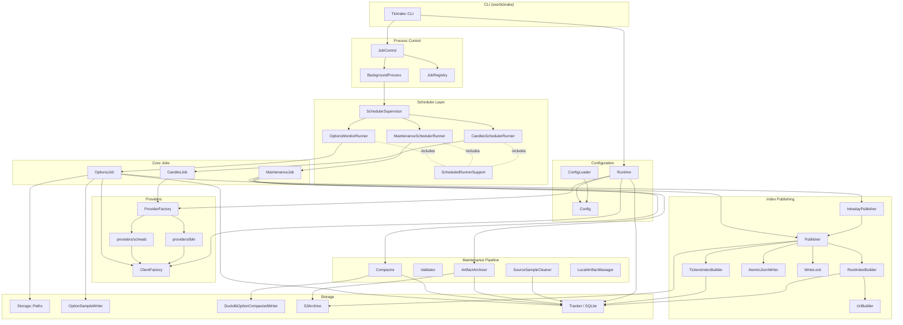

# Tickrake Architecture

Tickrake is a Ruby gem that collects, compacts, archives, and publishes financial market data — primarily options chain snapshots and OHLCV candles — from broker APIs (Schwab, IBKR) into local storage and S3. It also publishes machine-readable JSON index files that downstream consumers (Options Monitor, QStudy, research notebooks) read to discover available datasets without touching Tickrake's internal SQLite database.

## High-Level Component Diagram



## Layers and Responsibilities

### CLI and Process Control

`Tickrake::CLI` (`lib/tickrake/cli.rb`) is the entry point for every user-facing command. It parses `argv`, loads config, builds a `Runtime`, and dispatches to the appropriate job or command.

`JobControl` and `BackgroundProcess` handle `start`, `stop`, and `restart`. When a job starts, `BackgroundProcess` calls `Process.spawn` with the tickrake executable and either `--scheduler` (for a plain scheduler loop) or `--supervisor` (for a self-restarting loop). The spawned process is detached and its PID is written to `JobRegistry` — a small JSON file under `~/.tickrake/` used to track running processes.

### Scheduler Layer

Each job type has a corresponding runner class:

| Runner | Job Type | Schedule Type |
|---|---|---|
| `OptionsMonitorRunner` | options | window + interval |
| `MaintenanceSchedulerRunner` | maintenance | daily run\_at or interval |
| `CandlesSchedulerRunner` | candles | daily run\_at |

All three include `ScheduledRunnerSupport`, which provides iteration resilience: consecutive failure counting, provider-level serialization locks (`Lockfile`), and `SchedulerRestartRequired` signals that propagate up to `SchedulerSupervisor`.

`SchedulerSupervisor` wraps a child scheduler process and restarts it if it exits unexpectedly or exits with the restart-required exit code (75). The restart delay is taken from the provider's `restart_cooldown_seconds` setting.

### Core Jobs

**`OptionsJob`** fetches live option chain snapshots from the Schwab API. It:
1. Resolves a queue of `{symbol, option_root, expiration_date}` tuples from the job universe and DTE buckets.
2. Assigns a `collection_id` (e.g. `options-20260823T154210Z`) for the entire run.
3. Processes the queue with a thread pool (`max_workers`).
4. Writes each chain snapshot as a CSV via `OptionSampleWriter` and upserts metadata into SQLite.
5. After the queue completes, calls `IntradayPublisher` to update `ROOT.json` for each root.

**`CandlesJob`** fetches OHLCV bars from IBKR or Schwab. It supports incremental updates (looks up the last stored date and fetches only the delta), chunked date ranges for IBKR, and multiple frequencies per symbol.

**`MaintenanceJob`** runs an ordered pipeline of `compact` and `archive` steps against a set of option roots and a sample date (defaults to today). Steps are defined in the job's `tasks:` config list. See `docs/jobs.md` for the full pipeline.

### Providers

`ProviderFactory` builds a provider instance for the configured adapter (`schwab` or `ibkr`). The Schwab adapter wraps `schwab_rb` and uses `ClientFactory` to build a fresh `SchwabRb` client per run, picking up any refreshed OAuth token. The IBKR adapter wraps `ibkr_rb`.

### Storage Layer

`Storage::Paths` derives all file paths from config (data\_dir, history\_dir, options\_dir). Raw option snapshots land at:

```
<options_dir>/<provider>/<YYYY>/<MM>/<DD>/<ROOT>_exp<EXPIRATION>_<YYYY-MM-DD>_<HH-MM-SS>.csv
```

Compacted artifacts land at:

```
<options_dir>/<provider>/<YYYY>/<MM>/<DD>/<ROOT>_samples_<YYYY-MM-DD>.csv
<options_dir>/<provider>/<YYYY>/<MM>/<DD>/<ROOT>_samples_<YYYY-MM-DD>.parquet
```

`DuckdbOptionCompactedWriter` reads raw CSVs via DuckDB, merges them into a typed schema, and exports both CSV and Parquet in a single in-memory pass.

`S3Archive` maps local paths to S3 keys by computing the `data_dir`-relative path and prepending the configured prefix.

`Tracker` wraps SQLite with a thread-safe `Monitor` lock and WAL mode. It owns all schema migrations and is the single source of truth for file metadata. See `docs/data_model.md` for the full schema.

### Index Publishing

`Publisher` and `IntradayPublisher` write `ROOT.json` and `tickers.json` after job completions. `RootIndexBuilder` and `TickersIndexBuilder` query `Tracker` and build the JSON payload in memory. `AtomicJsonWriter` writes a `.tmp.PID` file, fsyncs it, and renames it atomically. `WriteLock` serializes concurrent writers for the same root using a filesystem lock file. See `docs/index_publishing.md` for the full detail.

### Configuration

`ConfigLoader` parses `tickrake.yml` and constructs a `Config` object. `Runtime` is a per-invocation context object holding config, tracker, client factory, provider factory, and logger. All job classes receive a `runtime` argument rather than accessing globals.

## Key Design Decisions

**SQLite is internal-only.** Downstream consumers read published JSON index files, not the SQLite database. This keeps the storage format evolvable without breaking consumers.

**Explicit migrations.** Tickrake does not auto-migrate on startup. Users run `tickrake migrate` explicitly. This prevents silent schema changes in long-running production setups.

**Atomic file writes.** All index JSON files are written via temp-file-plus-rename so consumers never see a partial file.

**Provider serialization.** Schwab's API has per-client rate limits. Multiple jobs that share a Schwab provider acquire a cross-process lockfile before each iteration so concurrent schedulers do not issue simultaneous API requests.

**Compaction safety.** Raw snapshots are deleted only after compaction validation succeeds. Compacted artifacts are deleted locally only after S3 upload and size verification succeed.
