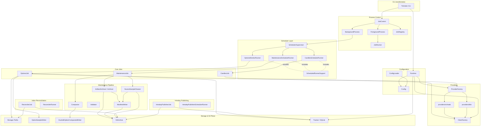

# Tickrake Architecture

Tickrake is a Ruby gem that collects, compacts, archives, and publishes financial market data — primarily options chain snapshots and OHLCV candles — from broker APIs (Schwab, IBKR) into local storage and S3. It also publishes machine-readable JSON index files that downstream consumers (Options Monitor, QStudy, research notebooks) read to discover available datasets without touching Tickrake's internal SQLite database.

## High-Level Component Diagram


```mermaid
graph TB
    %% ── Interface Layer ──────────────────────────────────────────
    subgraph CLI ["CLI (exe/tickrake)"]
        cli[Tickrake::CLI]
    end

    subgraph Control ["Process Control"]
        jc[JobControl]
        bp[BackgroundProcess]
        fp[ForegroundProcess]
        jr[JobRegistry]
        jrun[JobRunner]
    end

    subgraph Config ["Configuration"]
        config[Config]
        loader[ConfigLoader]
        runtime[Runtime]
    end

    %% ── Business Logic Layer ─────────────────────────────────────
    subgraph Jobs ["Scheduler Layer"]
        sup[SchedulerSupervisor]
        omr[OptionsMonitorRunner]
        msr[MaintenanceSchedulerRunner]
        csr[CandlesSchedulerRunner]
        srs[ScheduledRunnerSupport]
    end

    subgraph CoreJobs ["Core Jobs"]
        oj[OptionsJob]
        mj[MaintenanceJob]
        cj[CandlesJob]
    end

    subgraph Providers ["Providers"]
        pf[ProviderFactory]
        schwab[providers/schwab]
        ibkr[providers/ibkr]
        cf[ClientFactory]
    end

    subgraph Maintenance ["Maintenance Pipeline"]
        compactor[Compactor]
        validator[Validator]
        cleaner[SourceSampleCleaner]
        archiver[ArtifactArchiver / Archiver]
        manifest_writer[ManifestWriter]
    end

    subgraph Reconciler ["Index Reconciliation"]
        rec[ReconcilerJob]
        rec_runner[ReconcilerRunner]
    end

    subgraph IntradayIndex ["Intraday Publishing"]
        ipub[IntradayPublisherJob]
        ipub_runner[IntradayPublisherSchedulerRunner]
    end

    subgraph Storage ["Storage & S3 Plane"]
        paths[Storage::Paths]
        osw[OptionSampleWriter]
        duck[DuckdbOptionCompactedWriter]
        s3[S3Archive]
        tracker[Tracker / SQLite]
    end

    cli --> jc
    cli --> runtime
    jc --> bp
    jc --> fp
    jc --> jr
    fp --> jrun
    bp --> sup
    sup --> omr
    sup --> msr
    sup --> csr
    omr --> oj
    msr --> mj
    csr --> cj
    omr -.includes.- srs
    msr -.includes.- srs
    csr -.includes.- srs

    oj --> cf
    oj --> paths
    oj --> osw
    oj --> tracker

    mj --> compactor
    mj --> archiver
    mj --> cleaner
    compactor --> duck
    archiver --> s3
    archiver --> manifest_writer
    manifest_writer --> s3
    cleaner --> manifest_writer
    cleaner --> s3

    rec --> s3
    rec --> paths

    ipub --> tracker
    ipub --> s3

    cj --> pf
    pf --> schwab
    pf --> ibkr
    schwab --> cf
    ibkr --> cf

    runtime --> config
    runtime --> tracker
    runtime --> cf
    runtime --> pf
    loader --> config
```

## Layers and Responsibilities

### CLI and Process Control

`Tickrake::CLI` (`lib/tickrake/cli.rb`) is the entry point for every user-facing command. It parses `argv`, loads config, builds a `Runtime`, and dispatches to the appropriate job or command.

`JobControl` handles `start`, `stop`, and `restart`. By default `tickrake start --job X` runs the job in the foreground via `ForegroundProcess`, which blocks until the job exits — making it suitable as a Docker container command. Passing `--detach` switches to `BackgroundProcess`, which calls `Process.spawn` to launch a detached child process and writes its PID to `JobRegistry` (a JSON file per job under `~/.tickrake/jobs/`).

`JobRunner` is a shared module that centralizes runner dispatch. Both `ForegroundProcess` and the internal `--scheduler`/`--supervisor` paths in the CLI delegate to `JobRunner.run`, which selects the appropriate runner class based on job type and whether supervisor restart behavior is requested.

### Scheduler Layer

Each job type has a corresponding runner class:

| Runner | Job Type | Schedule Type |
|---|---|---|
| `OptionsMonitorRunner` | options | window + interval |
| `MaintenanceSchedulerRunner` | maintenance | daily run\_at or interval |
| `CandlesSchedulerRunner` | candles | daily run\_at or interval |
| `ReconcilerRunner` | reconcile | daily run\_at or interval |
| `IntradayPublisherSchedulerRunner` | intraday_publish | recurring interval (e.g. 15s) |

Scheduled runners include `ScheduledRunnerSupport`, which provides iteration resilience: consecutive failure counting, provider-level serialization locks (`Lockfile`), and `SchedulerRestartRequired` signals that propagate up to `SchedulerSupervisor`.

`SchedulerSupervisor` wraps a child scheduler process and restarts it if it exits unexpectedly or exits with the restart-required exit code (75). The restart delay is taken from the provider's `restart_cooldown_seconds` setting.

### Core Jobs

**`OptionsJob`** fetches live option chain snapshots from the Schwab API. It:
1. Resolves a queue of `{symbol, option_root, expiration_date}` tuples from the job universe and DTE buckets.
2. Assigns a `collection_id` (e.g. `options-20260823T154210Z`) for the entire run.
3. Processes the queue with a thread pool (`max_workers`).
4. Writes each chain snapshot as a CSV via `OptionSampleWriter` and writes `.meta.json` sidecars (ingested into SQLite by `MetadataSyncJob`).

**`CandlesJob`** fetches OHLCV bars from IBKR or Schwab. It supports incremental updates (looks up the last stored date and fetches only the delta), chunked date ranges for IBKR, and multiple frequencies per symbol.

**`MaintenanceJob`** runs an ordered pipeline of `compact`, `archive`, and `clean_sources` steps for options and candles. Steps are defined in the job's `tasks:` config list. See `docs/jobs.md` for the full pipeline.

**`IntradayPublisherJob`** periodically scans current-day SQLite metadata and local candle directories, syncs top-of-series (`latest/`), full intraday chronological series (`<YYYY-MM-DD>/`), and candles into the intraday storage plane (MinIO / S3), and publishes the live per-root `<ROOT>.json` index.

**`ReconcilerJob`** scans immutable audit manifests in S3 (`manifests/options/<provider>/` and `manifests/candles/<provider>/`), groups entries, and builds durable discovery indexes (`ROOT.json`, `tickers.json`, `<symbol>.json`, and `candles.json`) stored locally and in S3.

### Providers

`ProviderFactory` builds a provider instance for the configured adapter (`schwab` or `ibkr`). The Schwab adapter wraps `schwab_rb` and uses `ClientFactory` to build a fresh `SchwabRb` client per run, picking up any refreshed OAuth token. The IBKR adapter wraps `ibkr_rb`.

### Storage Layer

`Storage::Paths` derives all file paths from config (`data_dir`, `candles_dir`, `options_dir`). Raw option snapshots land at:

```
<options_dir>/<provider>/<YYYY>/<MM>/<DD>/<ROOT>_exp<EXPIRATION>_<YYYY-MM-DD>_<HH-MM-SS>.csv
```

Compacted option artifacts land at:

```
<options_dir>/<provider>/<YYYY>/<MM>/<DD>/<ROOT>_samples_<YYYY-MM-DD>.csv
<options_dir>/<provider>/<YYYY>/<MM>/<DD>/<ROOT>_samples_<YYYY-MM-DD>.parquet
```

Compacted candle artifacts land at:

```
<candles_dir>/<provider>/<frequency>/<YYYY>/<symbol>.parquet
```

`DuckdbOptionCompactedWriter` reads raw CSVs via DuckDB, merges them into a typed schema, and exports Parquet (and optional CSV) in a single in-memory pass.

`S3Archive` maps local paths to S3 keys by computing the `data_dir`-relative path and prepending the configured prefix. It also provides low-level S3 upload, download, key listing, and HEAD verification helpers.

`Tracker` wraps SQLite with a thread-safe `Monitor` lock and WAL mode. In the modern architecture, `Tracker` (`file_metadata_cache`) serves solely as a short-lived **intraday processing buffer** (rows older than 10 days are pruned by `MetadataSyncJob`). It does not track long-term historical archives.

### Manifest and Index Architecture

Tickrake separates intraday live state from durable historical archives through two distinct indexing mechanisms:

#### 1. Audit Manifests (Source of Truth)
During maintenance archival, `ManifestWriter` writes an immutable JSON manifest directly to S3 under `manifests/`:
- **Options**: `manifests/options/<provider>/<root>_<sample_date>.json` recording artifact URIs (`.parquet`), row count, and `archived_at`.
- **Candles**: `manifests/candles/<provider>/<symbol>.json` recording frequencies, partitioned years, datetime coverage ranges, row counts, and URIs.

Before `SourceSampleCleaner` deletes local raw snapshot CSVs, it validates:
1. The manifest exists in S3.
2. Every artifact URI listed in the manifest exists in S3 (HEAD request check).
3. Artifact row counts are greater than zero.

#### 2. Reconciled Historical Indexes (`ReconcilerJob`)
`ReconcilerJob` is an idempotent, standalone process that builds canonical historical indexes by inspecting S3 manifests:
- **Options**: Aggregates all manifests for `<provider>` by root, producing `<options_dir>/<provider>/<ROOT>.json` (with the `historical` array) and `<options_dir>/<provider>/tickers.json`.
- **Candles**: Reads candle manifests, producing `<candles_dir>/<provider>/<symbol>.json` and `<candles_dir>/<provider>/candles.json`.
- Uses `AtomicJsonWriter` (writes to `.tmp.PID`, fsyncs, and renames atomically) for crash-safe local writes, then uploads the index files to S3. Also writes local discovery caches under `<data_dir>/index_cache/<provider>/`.

#### 3. Live Intraday Indexing (`IntradayPublisherJob`)
`IntradayPublisherJob` runs at short intervals during trading hours. It inspects today's active rows in `Tracker` and local candles, syncs snapshot files to the intraday datastore (MinIO/S3), and writes live per-root `<ROOT>.json` indexes containing `option_chains.latest` and `option_chains.series`. It also performs daily eviction under `intraday/` when reaching `clear_at`.

### Configuration

`ConfigLoader` parses `tickrake.yml` and constructs a `Config` object. `Runtime` is a per-invocation context object holding config, tracker, client factory, provider factory, and logger. All job classes receive a `runtime` argument rather than accessing globals.

## Conceptual Layers

Tickrake is organized into five layers, each independently useful:

| Layer | Components | Can be used standalone? |
|---|---|---|
| **Collection** | `OptionsJob`, `CandlesJob`, `LevelOneJob`, `OrderBookJob` | Yes — write CSVs/Parquet locally with no other infrastructure |
| **Scheduling** | `SchedulerSupervisor`, runner classes, `ScheduledRunnerSupport` | Wraps any collection job with interval + window logic |
| **Indexing** | `Tracker` / `file_metadata_cache`, `MetadataSyncJob`, `ManifestWriter`, `ReconcilerJob` | Builds short-lived intraday queues in SQLite and durable audit manifests in S3 |
| **Storage** | `S3Archive`, `DuckdbOptionCompactedWriter`, `MaintenanceJob` | Local by default; S3/MinIO for archiving, manifests, and intraday publishing |
| **Presentation** | `IntradayPublisherJob`, `ReconcilerJob` | Surfaces live data to MinIO and durable catalog indexes to S3 / local disk |

A **validation layer** covers two concerns:
- **Operational validation** — did compaction output non-empty Parquet files matching expected source counts? Did S3 upload succeed with matching byte size? Does the S3 manifest verify before source deletion?
- **Data quality validation** — handled during DuckDB compaction typing and sorting.

### Metadata Sidecar Pipeline

The indexing layer uses an append-only sidecar pattern to avoid contention between collection workers and the SQLite writer:

```
options_job  →  writes .meta.json sidecar  →  pending_metadata_dir/
metadata_sync  →  reads sidecars  →  upserts file_metadata_cache  →  deletes sidecar
intraday_publisher  →  queries file_metadata_cache  →  uploads CSVs + JSON indexes to Minio
```

This keeps collection workers free of SQLite writes during hot loops.

### Streaming Event Pipeline

Streaming jobs (`LevelOneJob`, `OrderBookJob`) use an append-only NDJSON staging pattern for the same reason:

```
level_one_job / order_book_job  →  appends events to .ndjson.tmp  →  pending_events_dir/
                                   rotates to .ndjson on rotation interval or size threshold
events_ingestor  →  reads .ndjson files  →  writes Parquet  →  uploads to S3  →  deletes file
```

## Key Design Decisions

**S3 Manifests are the source of truth for historical archives.** SQLite does not maintain long-term archive records. Manifests written to S3 are immutable and bitemporal. If local metadata or index files are destroyed, `ReconcilerJob` reconstructs the entire index hierarchy from S3 manifests.

**SQLite is internal and intraday-only.** Downstream consumers read published JSON index files (`intraday/<provider>/<root>.json` or reconciled archive indexes), never SQLite. The table is automatically pruned of rows older than 10 days.

**Explicit migrations.** Tickrake does not auto-migrate on startup. Users run `tickrake migrate` explicitly. This prevents silent schema changes in long-running production setups.

**Atomic file writes.** All index and cache JSON files are written via `AtomicJsonWriter` (temp file + fsync + atomic rename) so consumers never see a partial write.

**Compaction and deletion safety.** Raw snapshots are deleted only after compaction succeeds, the S3 manifest is written, and every artifact in the manifest is confirmed accessible on S3 with valid row counts. Compacted artifacts are deleted locally only after S3 upload and size verification succeed.
