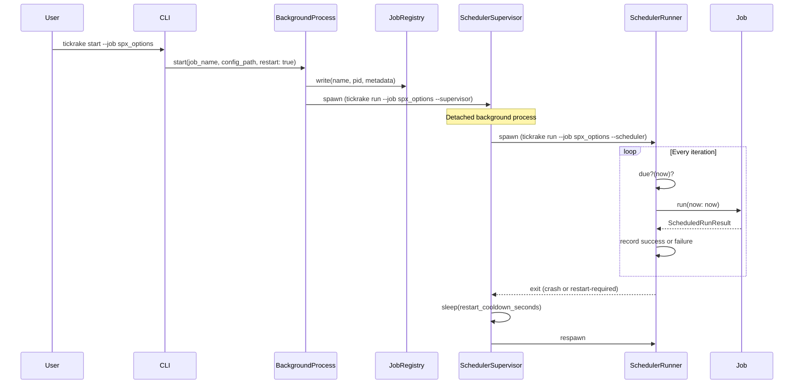
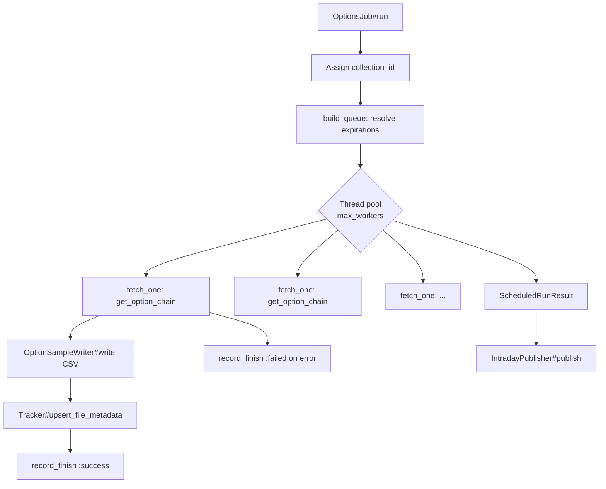
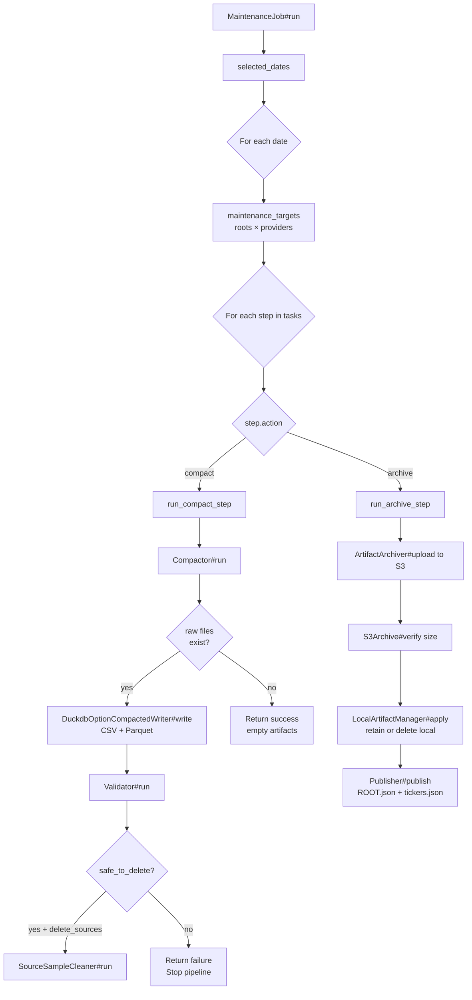

# Job System

Tickrake has three job types — `options`, `candles`, and `maintenance` — plus an import facility for bulk historical data. Each job type can run as a long-lived background scheduler or as a one-off command. This document covers how jobs are defined, started, supervised, and how the three core job types behave internally.

## Job Lifecycle



### Starting a Job

`tickrake start --job NAME` invokes `JobControl#start`. By default the job runs in the **foreground** — `ForegroundProcess` loads the config, builds a `Runtime`, and delegates to `JobRunner.run`, which selects the appropriate runner class based on job type. The call blocks until the job exits, making it the right choice for Docker containers where PID 1 must stay alive.

Passing `--detach` switches to background mode: `BackgroundProcess` spawns a detached child process and writes its PID and metadata to `JobRegistry` (a JSON file per job under `~/.tickrake/jobs/`). Use this when running jobs on a Mac or Linux host where the terminal needs to return to the prompt.

`tickrake start --job all` starts every non-manual scheduled job defined in config.

### Stopping a Job

`tickrake stop --job NAME` sends `TERM` to the registered PID. The scheduler runner catches `TERM`, sets `@shutdown_requested = true`, and exits cleanly after the current iteration finishes.

### Restarting a Job

`tickrake restart --job NAME` stops the running job (waiting indefinitely for the current iteration to finish), then starts a new one using the metadata persisted in `JobRegistry` (config path, provider override, restart policy).

### Supervisor Mode

When started with `--supervisor`, `SchedulerSupervisor` owns a child process running `--scheduler`. If the child exits with a non-zero status, the supervisor logs the exit, sleeps `restart_cooldown_seconds` (from provider config, default 5 s), and respawns it. If the child exits cleanly (status 0), the supervisor exits too. TERM and INT signals are forwarded to the child PID and also set `@shutdown_requested` so the supervisor does not respawn after the child exits.

### Scheduler Resilience (`ScheduledRunnerSupport`)

All three runner classes include `ScheduledRunnerSupport`, which provides:

- **Consecutive failure counting.** Each degraded result or raised exception increments `@consecutive_failures` for the configured provider. Once the count reaches `restart_after_consecutive_failures` (default 3 for Schwab), the runner raises `SchedulerRestartRequired`, which propagates out of the iteration loop and exits with status 75. The supervisor recognizes this exit code as a planned restart.
- **Provider serialization.** Schwab provider definitions have `serialize_scheduled_jobs: true` by default. Before each iteration, the runner acquires a cross-process lockfile (`~/.tickrake/tickrake-provider-schwab-scheduled.lock`). If the lock is held by another scheduler, the iteration is deferred (returns `:deferred`) rather than running concurrently.

## Job Configuration

Jobs are defined in the `schedule:` block of `tickrake.yml`. Example:

```yaml
schedule:
  spx_0dte_options:
    type: options
    provider: schwab
    interval: 600        # seconds between runs
    windows:
      - days: [mon, tue, wed, thu, fri]
        start: "08:25"
        end:   "15:15"
    dte_buckets: [0]
    universe:
      - symbol: $SPX.X
        option_root: SPXW

  eod_candles:
    type: candles
    provider: ibkr-live
    run_at: "16:00"
    days: [mon, tue, wed, thu, fri]
    lookback_days: 5
    universe:
      - symbol: SPY
        frequencies: [day]
        start_date: "2020-01-01"

  compact_spxw:
    type: maintenance
    provider: schwab
    run_at: "15:10"
    days: [mon, tue, wed, thu, fri]
    tasks:
      - compact:
          subject: option_samples
          universe: spx_symbols
          delete_sources: true
      - archive:
          subject: option_samples
          universe: spx_symbols
          destination: s3_archive
          artifacts: [csv, parquet]
          retain_local:
            parquet: true
```

Key scheduling fields:

| Field | Applies To | Description |
|---|---|---|
| `interval` | options, maintenance | Seconds between iterations (interval schedule) |
| `windows` | options, maintenance | Time windows during which the job may run |
| `run_at` | candles, maintenance | Daily time trigger (HH:MM) |
| `days` | candles, maintenance | Which weekdays the job runs |
| `manual: true` | any | Job can only run via `tickrake run --job NAME`, not as a scheduler |

## OptionsJob

`OptionsJob` collects option chain snapshots from the Schwab API on a repeated intraday schedule.



**Queue building.** For each symbol in the job universe, `OptionsJob` calls `client.get_option_expiration_chain` to resolve the broker-reported expirations matching the configured DTE buckets. Symbols with no matching expiration for a bucket are skipped and logged. The queue is a flat list of `{symbol, option_root, provider_name, expiration_date, requested_buckets}` hashes.

**Parallel fetching.** A thread pool of up to `max_workers` threads processes the queue cooperatively using a mutex-guarded index. Each thread calls `client.get_option_chain` with a per-fetch timeout, writes the result to a dated CSV file, upserts metadata into SQLite, and records the fetch outcome.

**collection\_id.** Each `OptionsJob#run` call generates a single `collection_id` stamped with the UTC run time (`options-YYYYMMDDTHHMMSSZ`). This ID links all fetches from the same iteration in both `fetch_runs` and `file_metadata_cache`, enabling `IntradayPublisher` to verify completeness.

**Retry logic.** Each `fetch_one` call retries up to `retry_count` times with `retry_delay_seconds` sleep between attempts. After exhausting retries the fetch is recorded as failed and the queue continues.

**Intraday publish.** After the full queue completes, `IntradayPublisher#publish` is called with the expected counts per `(provider, root)`. If all expected expirations were successfully fetched, `Publisher#publish` is called to regenerate `ROOT.json` and `tickers.json`. See `docs/index_publishing.md`.

**File path shape:**

```
<options_dir>/<provider>/<YYYY>/<MM>/<DD>/<ROOT>_exp<EXPIRATION>_<YYYY-MM-DD>_<HH-MM-SS>.csv
```

Example:
```
~/.tickrake/data/options/schwab/2026/08/23/SPXW_exp2026-08-23_2026-08-23_15-42-10.csv
```

The timestamp component respects `options.snapshot_filename_timezone` in config (`utc` or a TZ name like `America/Chicago`).

## CandlesJob

`CandlesJob` fetches OHLCV bar history from IBKR or Schwab.

**Incremental fetching.** If the output file already exists, the job computes a `lookback_start` date (`today - lookback_days`) and requests only bars since then. On the first run (no file), it requests from `entry.start_date`.

**Chunking.** IBKR imposes per-request date range limits per frequency. `CandlesJob` automatically chunks large date ranges into smaller requests (e.g. 6-day chunks for 1-minute data) and reconciles each chunk into the output file via `CandleReconciler`.

**File path shape:**

```
<history_dir>/<provider>/<SYMBOL>_<frequency>.csv
```

Example:
```
~/.tickrake/data/history/ibkr-paper/SPY_day.csv
```

## MaintenanceJob

`MaintenanceJob` runs an ordered pipeline of steps against each option root and sample date.



**Date selection.** Without `--start-date`/`--end-date`, the job processes today's date. With date range flags the job iterates each day in the range.

**Compact step.**
1. `Compactor` finds all raw snapshot CSVs for the given provider/root/date.
2. `DuckdbOptionCompactedWriter` opens an in-memory DuckDB database, loads each raw CSV, and exports a merged and type-cast CSV and Parquet artifact.
3. `Validator` compares the compacted row count against the sum of source file row counts.
4. If validation passes and `delete_sources: true`, `SourceSampleCleaner` deletes the raw CSVs and removes their `file_metadata_cache` rows.

**Archive step.**
1. `ArtifactArchiver` uploads the compacted CSV and/or Parquet (as specified by `artifacts:`) to S3 via `S3Archive#upload`.
2. It immediately calls `S3Archive#verify` (HEAD request) and checks that the remote object size matches the local file size.
3. `LocalArtifactManager` deletes or retains local compacted files based on the `retain_local:` config (e.g. `retain_local: {parquet: true}` keeps the parquet locally).
4. `MaintenanceJob#publish_index` calls `Publisher#publish` to update `ROOT.json` and `tickers.json` after a successful archive.

**Pipeline short-circuit.** If any step returns a failure result, the remaining steps for that root/date combination are skipped. The job continues processing other roots and dates and reports the total failure count.

## Candle Scheduler (CandlesSchedulerRunner)

The candles scheduler uses a daily-at schedule (`run_at` + `days`). It runs once per calendar day at or after the configured time. The `from_config_start` flag (`--from-config-start`) causes `CandlesJob` to use the `entry.start_date` as the request start rather than the lookback window — useful for initial backfills.

## Manual Jobs

Setting `manual: true` in a job config prevents it from being started as a background scheduler. Manual jobs run once via `tickrake run --job NAME` and exit. This is useful for maintenance jobs that should only run on demand rather than on a schedule.
