# Storage Layout & Data Architecture

Tickrake partitions market data storage into three distinct tiers based on durability, query patterns, and lifecycle requirements:

1. **Intraday Storage Plane (MinIO / S3-compatible)**: Ephemeral, low-latency live cache of current-session option snapshots, candle bars, and state manifests.
2. **Long-Term Archive Plane (AWS S3)**: Durable, columnar historical datasets (Apache Parquet) and audit manifests for research, analytics, and backtesting.
3. **Local Filesystem Plane (`~/.tickrake/`)**: Host- or container-local staging for uncompacted raw CSV scrapes, WAL-mode SQLite metadata cache, and process logs.

```mermaid
flowchart TD
    subgraph LocalHost["Local Filesystem (~/.tickrake/)"]
        ScrapeCSV["Raw Option CSVs<br/>~/.tickrake/data/options/..."]
        CandleCSV["Raw Candle CSVs<br/>~/.tickrake/data/candles/..."]
        MetaDB["SQLite Metadata Cache<br/>~/.tickrake/tickrake.sqlite3"]
    end

    subgraph IntradayPlane["Intraday Storage (MinIO)"]
        IntradayLatest["Top of Series<br/>intraday/:provider/options/latest/..."]
        IntradaySeries["Intraday History<br/>intraday/:provider/options/:date/..."]
        IntradayCandles["Intraday Candles<br/>intraday/:provider/candles/..."]
        IntradayIndex["Live Root Manifest<br/>intraday/:provider/:root.json"]
    end

    subgraph ArchivePlane["Long-Term Storage (AWS S3)"]
        CompactedParquet["Compacted Daily Options<br/>options/:provider/YYYY/MM/DD/:root_samples_:date.parquet"]
        CandleParquet["Compacted Annual Candles<br/>candles/:provider/:freq/YYYY/:symbol.parquet"]
        Manifests["Audit Manifests<br/>manifests/:dataset/:provider/..."]
        StreamingParquet["Level 1 / Order Book / Fundamentals<br/>level_one/, order_book/, fundamentals/"]
    end

    ScrapeCSV -->|IntradayPublisherJob| IntradayLatest & IntradaySeries & IntradayIndex
    CandleCSV -->|IntradayPublisherJob| IntradayCandles & IntradayIndex
    ScrapeCSV -->|MaintenanceJob: Compact & Archive| CompactedParquet & Manifests
    CandleCSV -->|MaintenanceJob: Compact & Archive| CandleParquet
```



---

## 1. Intraday Storage Plane (MinIO / S3-Compatible)

The intraday storage plane provides fast, decoupled data discovery for real-time consumers such as `options-monitor` during trading hours without querying Tickrake's internal SQLite database or mounting shared container volumes.

All intraday keys reside under the `intraday/` prefix in the configured intraday datastore (e.g., `minio_intraday`).

### Directory & Key Structure

```text
s3://<intraday-bucket>/
└── intraday/
    └── <provider>/                          # e.g., schwab, ibkr
        ├── <ROOT>.json                      # Per-root unified live index (e.g., SPY.json, SPXW.json)
        ├── candles/
        │   └── <frequency>/                 # e.g., 1min, 5min
        │       └── <symbol>.csv             # e.g., SPY.csv, QQQ.csv
        └── options/
            ├── latest/                      # Top-of-series: fast point-in-time state
            │   └── <root>_exp<expiration>.csv
            │       # e.g., SPXW_exp2026-09-21.csv
            └── <YYYY-MM-DD>/                # Full chronological intraday time series history
                └── <root>_exp<expiration>_<timestamp>.csv
                    # e.g., SPXW_exp2026-09-21_2026-09-21_14-30-00.csv
                    #       SPXW_exp2026-09-21_2026-09-21_14-35-00.csv
```

### Key Artifact Descriptions

#### 1. Top of Series (`latest/`)
- **Key Pattern**: `intraday/<provider>/options/latest/<root>_exp<expiration>.csv`
- **Purpose**: Point-in-time state of the option chain. Overwritten on each scrape iteration with the newest available data.
- **Consumer Use Case**: Dashboards and live pricing engines needing only the current state without scanning historical session samples.
- **Eviction**: When an expiration contract rolls off or expires, stale keys in `latest/` are deleted.

#### 2. Intraday History (`<sample_date>/`)
- **Key Pattern**: `intraday/<provider>/options/<sample_date>/<root>_exp<expiration>_<timestamp>.csv`
- **Purpose**: Immutable time-series history of every chain snapshot captured throughout the trading day.
- **Consumer Use Case**: Charts tracking intraday Greek evolution (delta/gamma risk progression), implied volatility surface smile/skew shifts, open interest accumulation, and volume build-up.
- **Eviction**: **Never evicted during the trading session.** All snapshots of the active trading date remain accessible throughout the day and evening.
- **Upload Optimization**: Incremental. Existing keys under `intraday/<provider>/options/<sample_date>/` are checked before upload so only newly recorded snapshots are pushed.

#### 3. Intraday Candles
- **Key Pattern**: `intraday/<provider>/candles/<frequency>/<symbol>.csv`
- **Purpose**: Live bar data for underlying symbols matching the option chains.

#### 4. Live Root Index (`<root>.json`)
- **Key Pattern**: `intraday/<provider>/<root>.json`
- **Purpose**: The authoritative contract between Tickrake and downstream consumers. Identifies both top-of-series (`latest`) and chronological intraday history (`series`).

```json
{
  "provider": "schwab",
  "root": "SPY",
  "updated_at": "2026-09-21T20:00:00Z",
  "option_chains": {
    "sample_date": "2026-09-21",
    "status": "complete",
    "latest": {
      "sampled_at": "2026-09-21T20:00:00Z",
      "files": [
        {
          "expiration_date": "2026-09-21",
          "format": "csv",
          "uri": "s3://tickrake-intraday/intraday/schwab/options/latest/SPY_exp2026-09-21.csv",
          "row_count": 52
        }
      ]
    },
    "series": [
      {
        "expiration_date": "2026-09-21",
        "sampled_at": "2026-09-21T14:30:00Z",
        "format": "csv",
        "uri": "s3://tickrake-intraday/intraday/schwab/options/2026-09-21/SPY_exp2026-09-21_2026-09-21_14-30-00.csv",
        "row_count": 50
      },
      {
        "expiration_date": "2026-09-21",
        "sampled_at": "2026-09-21T14:35:00Z",
        "format": "csv",
        "uri": "s3://tickrake-intraday/intraday/schwab/options/2026-09-21/SPY_exp2026-09-21_2026-09-21_14-35-00.csv",
        "row_count": 52
      }
    ]
  },
  "candles": {
    "files": [
      {
        "frequency": "1min",
        "format": "csv",
        "uri": "s3://tickrake-intraday/intraday/schwab/candles/1min/SPY.csv",
        "row_count": 390
      }
    ]
  }
}
```

### Intraday Lifecycle & Eviction (`clear_at`)

Intraday storage is decoupled from historical maintenance jobs. To prevent disk/object unbounded growth across days, `IntradayPublisherJob` manages daily resets through a configurable DSL parameter:

```ruby
Tickrake.job "intraday_publisher" do
  schedule do
    every 15.seconds
  end

  intraday_publish do
    datastore :minio_intraday
    clear_at "00:00" # Defaults to midnight ("00:00"). Can be set to any "HH:MM", or nil to disable.
  end
end
```

- When the job executes at or past `clear_at` for the current calendar date, all objects under the `intraday/` prefix are purged.
- This gives the upcoming trading day a clean slate while preserving all intraday progression throughout the session and evening.

---

## 2. Long-Term Historical Archive Plane (AWS S3)

The long-term archive plane holds permanent, compacted, columnar datasets stored in AWS S3 for backtesting, historical simulation, and analytical queries via DuckDB, ClickHouse, or Pandas.

Managed by `MaintenanceJob` during scheduled post-market batch runs.

> [!NOTE]
> **S3 Peer Folder Structure:**
> While local disk storage lives under `~/.tickrake/data/<dataset>/`, during S3 archival the local `data_dir` path is stripped. In the S3 bucket, **`options/`, `candles/`, `level_one/`, `order_book/`, `fundamentals/`, `economic_events/`, and `manifests/` are all peer top-level folders** directly at the root of the bucket (or under any configured bucket prefix). There is no enclosing `data/` folder in S3.

### Directory & Key Structure

```text
s3://<archive-bucket>/
├── options/
│   └── <provider>/
│       └── <YYYY>/<MM>/<DD>/
│           ├── <root>_samples_<YYYY-MM-DD>.parquet # Columnar compacted daily options
│           └── <root>_samples_<YYYY-MM-DD>.csv     # (Optional) Compacted CSV equivalent
│
├── candles/
│   └── <provider>/
│       └── <frequency>/
│           └── <YYYY>/
│               └── <symbol>.parquet         # Annual compacted columnar candle partition
│                   # e.g., candles/schwab/1min/2026/SPY.parquet
│
├── level_one/
│   └── <provider>/
│       └── <YYYY>/<MM>/<DD>/
│           └── <symbol>_<HHMMSS>Z.parquet   # Flushed Level 1 quote/trade tick events
│
├── order_book/
│   └── <provider>/
│       └── <YYYY>/<MM>/<DD>/
│           └── <symbol>_<HHMMSS>Z.parquet   # Flushed Level 2 depth / order book snapshots
│
├── fundamentals/
│   └── <provider>/
│       └── <YYYY>/<MM>/
│           └── <DD>.parquet                 # Daily fundamental metrics snapshot
│
├── economic_events/
│   └── <source>/                            # e.g., fred, bls
│       └── <category>/
│           └── <YYYY>/<MM>/
│               └── <DD>.parquet             # Scheduled macroeconomic calendar release data
│
└── manifests/
    ├── options/
    │   └── <provider>/
    │       └── <root>_<YYYY-MM-DD>.json     # Options audit manifest (checksums, row counts)
    └── candles/
        └── <provider>/
            └── <symbol>.json                # Candles audit manifest (available years & ranges)
```

### Key Artifact Descriptions

#### 1. Compacted Options Parquet
- **Key Pattern**: `options/<provider>/<YYYY>/<MM>/<DD>/<root>_samples_<YYYY-MM-DD>.parquet`
- **Contents**: All raw intraday CSV snapshots for that trading date compacted into a single, ZSTD-compressed Apache Parquet file.
- **Sorting**: Sorted by `sampled_at, expiration_date, contract_type, strike, symbol` for optimal compression and predicate pushdown in analytical engines.
- **Partitioning**: Natural date hierarchy (`YYYY/MM/DD`) enabling DuckDB and S3 filesystem partition pruning.

#### 2. Compacted Candles Parquet
- **Key Pattern**: `candles/<provider>/<frequency>/<YYYY>/<symbol>.parquet`
- **Contents**: Full calendar-year OHLCV bars partitioned annually per symbol.

#### 3. Audit Manifests
- **Key Pattern**: `manifests/<dataset_type>/<provider>/...`
- **Options Manifest**: `manifests/options/<provider>/<root>_<sample_date>.json`
- **Candles Manifest**: `manifests/candles/<provider>/<symbol>.json`
- **Purpose**: Verification and data-integrity record detailing artifact URIs, MD5 checksums, raw source file counts, and row counts.

---

## 3. Local Filesystem Plane (`~/.tickrake/`)

The local filesystem serves as the scratchpad and staging area for active worker containers. Here, all data sets are stored under the common `data/` subfolder.

### Directory Structure

```text
~/.tickrake/
├── tickrake.yml                             # Primary runtime configuration & datastore definitions
├── tickrake.sqlite3                         # Internal SQLite metadata cache & fetch run logs
├── tickrake.sqlite3-wal                     # Write-Ahead Log for concurrent readers
├── logs/
│   ├── options_job.log
│   ├── intraday_publisher.log
│   └── maintenance.log
└── data/                                    # All local datasets sit under data/
    ├── candles/
    │   └── <provider>/<frequency>/<symbol>.csv
    ├── options/
    │   └── <provider>/<YYYY>/<MM>/<DD>/
    │       └── <root>_exp<expiration>_<date>_<time>.csv
    ├── level_one/
    │   └── <provider>/<YYYY>/<MM>/<DD>/<symbol>_<timestamp>Z.parquet
    ├── order_book/
    │   └── <provider>/<YYYY>/<MM>/<DD>/<symbol>_<timestamp>Z.parquet
    ├── fundamentals/
    │   └── <provider>/<YYYY>/<MM>/<DD>.parquet
    └── economic_events/
        └── <source>/<category>/<YYYY>/<MM>/<DD>.parquet
```

### Local Path Conventions & Retention
- Local raw CSV snapshots are written directly by collection jobs (`OptionsJob`).
- Once `MaintenanceJob` runs, validates compaction against raw source files, and confirms S3 upload:
  - If `delete_sources: true` is configured in the maintenance task, raw local CSV files under `~/.tickrake/data/options/` are deleted to reclaim local disk space.
  - The SQLite `file_metadata_cache` tracks progress from `pending` -> `compacted` -> `archived`.

---

## 4. Consumer Access Patterns

| Consumer | Goal | Target Store | Recommended Query |
| :--- | :--- | :--- | :--- |
| **Options Monitor (Live State)** | Render current chain & Greeks | **MinIO** (Intraday) | 1. Fetch `intraday/<provider>/<root>.json`<br/>2. Read `option_chains.latest.files` |
| **Options Monitor (Charts)** | Intraday Greeks & IV progression over day | **MinIO** (Intraday) | 1. Fetch `intraday/<provider>/<root>.json`<br/>2. Query `option_chains.series` files via DuckDB |
| **Research / Backtesting** | Multi-day / multi-year option modeling | **AWS S3** (Archive) | DuckDB direct query on `s3://<bucket>/options/.../*.parquet` |
| **Data Discovery** | Discover available dates & root coverage | **AWS S3** (Archive) | Query `manifests/options/<provider>/...` or S3 directory prefix listing |
